# 🏛️ التقرير الهندسي الشامل لإعادة تصميم البنية المعمارية وواجهات المستخدم لنظام "جامعة المنار"
> **وثيقة الهندسة المعمارية الرسمية (Official Architecture & UI/UX Design System Specification)**
> **تاريخ التوثيق:** 2026-07-27
> **المواصفة:** نظام متكامل ذو أربع بوابات (الطالب، الإدارة، المحاضر، المطورين) مبني وفق معايير React 18 / iOS 18 Glassmorphism / Mobile-First / WCAG AA High Contrast.

---

## 📐 1. الرؤية المعمارية والتوجه الاستراتيجي

تمثل إعادة الهيكلة الشاملة لنظام **"جامعة المنار"** ببواباته المتعددة (**بوابة الطالب، بوابة الإدارة، بوابة المحاضر، وبوابة المطورين**) نقلة نوعية في تصميم الأنظمة الأكاديمية المؤسسية. تعتمد المنظومة على نهج هندسي دقيق يستفيد من أحدث معايير تطوير واجهات المستخدم (UI) وتجربة المستخدم (UX)، ويرتكز هذا التصميم على بناء بيئة تفاعلية حية (Live Single Page Application) تعتمد على تقنيات مكتبة **React** المتقدمة مع تحول جذري نحو فلسفة **التصميم الموجه للهواتف الذكية أولاً (Mobile-First)**.

```mermaid
graph TD
    A["📱 Al-Manar System Core"] --> B["🎓 Student Portal (StudentDashboard.jsx)"]
    A --> C["👨‍🏫 Lecturer Portal (LecturerDashboard.jsx)"]
    A --> D["🏛️ Admin Portal (AdminDashboard.jsx)"]
    A --> E["🛡️ Dev Portal (DevPortal.jsx)"]

    B --> B1["HomeTab (Countdown & Streak)"]
    B --> B2["ScheduleTab (Sandbox Simulator)"]
    B --> B3["ExchangeHubTab (AI Summary & Live Chat)"]
    B --> B4["ProfileTab (Digital ID & Barcode)"]
    B --> B5["GoalsTab (Pomodoro Timer)"]
    B --> B6["DelegateTab (QR & Broadcasts)"]

    C --> C1["LecturerAttendanceSession (QR Scanner)"]
    C --> C2["LecturerRequests (Overrides & CSV)"]

    D --> D1["OverviewTab & ScheduleTab"]
    D --> D2["ApprovalsTab & ExamsTab"]
    D --> D3["BulkImportTab & BroadcastTab"]

    E --> E1["Passcode Security Gateway"]
    E --> E2["ImpersonatorDirectory & Live Telemetry"]
    E --> E3["SQL Terminal & SelfHealingPatcher"]
```



---

## 💎 2. الفلسفة التصميمية: نهج Mobile-First وتأثيرات Glassmorphism

يعتمد التصميم الجديد لنظام جامعة المنار على بناء نظام بصري يعكس الحداثة والعمق الفراغي، مع التركيز بشكل خاص على الأجهزة المحمولة التي تشكل وسيلة الوصول الأساسية للطلاب. تم استلهام لغة التصميم من معايير واجهات أنظمة التشغيل الحديثة (**iOS 18**) التي تعتمد بشكل مكثف على تقنية **Glassmorphism (التأثير الزجاجي المضبب)**.

* **الملف المصدر لنظام التصميم:** [index.css](file:///f:/almanar-college-system/frontend/src/index.css)

### 🧪 آليات تنفيذ التأثير الزجاجي المضبب (CSS Architecture):
```css
.frosted-panel {
  background-color: var(--bg-card);               /* rgba(15, 23, 42, 0.88) */
  backdrop-filter: blur(14px) saturate(140%);
  -webkit-backdrop-filter: blur(14px) saturate(140%);
  border: 1px solid var(--border-color);          /* rgba(255, 255, 255, 0.08) */
  box-shadow: 0 0 0 1px rgba(255,255,255,0.02) inset, 0 8px 24px -8px rgba(0,0,0,0.50);
  transition: border-color 0.25s ease, box-shadow 0.25s ease, transform 0.15s ease;
}
```

### 📊 جدول الخصائص التقنية والوظائف المعمارية:
| الخاصية التقنية (CSS / Tailwind) | الوظيفة ضمن هندسة Glassmorphism & Mobile-First |
| :--- | :--- |
| `backdrop-filter: blur(14px)` | توليد تأثير التمويه الزجاجي للخلفية بدقة تحاكي واجهات الأنظمة الحديثة لتخفيف التشتت. |
| `saturate(140%)` | زيادة تشبع الألوان الكامنة خلف اللوحة الزجاجية لتعزيز الحيوية البصرية والتباين. |
| `overscroll-behavior-y: none` | منع ارتداد صفحة الويب الافتراضي للسماح بتنفيذ إيماءات السحب (Pull-to-Refresh) المخصصة. |
| `-webkit-tap-highlight-color` | إزالة الوميض اللوني الافتراضي عند النقر على الأزرار في شاشات اللمس. |
| `box-shadow: inset 0 0 0 1px` | إضافة انعكاس ضوئي داخلي دقيق يحاكي انكسار الضوء على حواف الزجاج المصقول. |
| `user-select: none` | منع تحديد النصوص العرضي أثناء استخدام إيماءات السحب واللمس السريعة. |

---

## ⚡ 3. بروتوكولات التفاعل البشري الحاسوبي (HCI) والردود الحركية

لضمان سلاسة وسرعة استثنائيتين تحاكيان التطبيقات الأصلية (Native Apps)، تم دمج مكتبة **Framer Motion** بشكل استراتيجي وعميق في كافة المكونات الدقيقة لبيئة React الخاصة بنظام جامعة المنار.

1. **إيماءات السحب والتحديث (Pull-to-Refresh):** إبطال السلوك الافتراضي للمتصفح عبر `overscroll-behavior-y: none` وربط إيماءات السحب بقيم الحركة `useMotionValue` واهتزازات التغذية الراجعة `haptics.success()`.
2. **إيماءات السحب الجانبي للإجراءات (Swipe-to-Action):** سحب المهام والرسائل في [GoalsTab.jsx](file:///f:/almanar-college-system/frontend/src/components/student/GoalsTab.jsx) و [ExchangeHubTab.jsx](file:///f:/almanar-college-system/frontend/src/components/student/ExchangeHubTab.jsx) يميناً للإنجاز ويساراً للحذف بمرونة خاضعة لفيزياء الزنبرك (`stiffness` & `damping`).
3. **المؤشرات النشطة والانزلاق الديناميكي:** استخدام خاصية `layoutId` في Framer Motion لتنقل مؤشر التبويب السفلي (Bottom Nav Dock) بسلاسة فائقة دون الحاجة لحساب إحداثيات DOM يدويّاً.
4. **الأيقونات التفاعلية المعزولة (Vector SVG Micro-components):** أيقونات متجهة قابلة للتوسع بدون غباشة ومزودة بحالات حركية (`variants`) للتفاعل مع الأحداث (مثل دوران مسار الـ QR أثناء المسح).

---

## 🎨 4. نظام الثيمات الديناميكي المتغير (Dynamic Theme & Font System)

يعتمد نظام الثيمات على متغيرات CSS الجذرية (`:root`) المرتبطة بـ Tailwind CSS، مما يتيح التبديل الفوري بين الألوان الثيمية والخطوط في أجزاء من الثانية دون إجبار React على إعادة تصيير الصفحات.

```css
:root {
  --bg-primary:   #070b13;                          /* أسود ليلي عميق */
  --bg-card:      rgba(15, 23, 42, 0.88);           /* زجاج داكن */
  --accent:         #f59e0b;                        /* كهرماني نيون ساطع */
  --accent-2:       #10b981;                        /* زمردي تفاعلي */
  --font-family: 'Cairo', 'Urbanist', 'Inter', sans-serif;
}

:root.light {
  --bg-primary:   #fcfbf7;                          /* أبيض عاجي ناعم */
  --bg-card:      #ffffff;                          /* زجاج ناصع */
  --accent:         #b8860b;                        /* ذهبي داكن مريح */
  --text-primary:   #1c1a14;                        /* بني فحمي */
}
```

---

## ♿ 5. معايير الوصول المتقدمة (WCAG AA & Forced Colors / WHCB)

يلتزم النظام بمعايير التباين **WCAG AA** مع دعم كامل لبروتوكول **Windows High Contrast / Forced Colors (WHCB)** لمنع انهيار الواجهات الزجاجية عند تفعيل وضع التباين العالي في نظام التشغيل.

```css
@media (forced-colors: active) {
  .frosted-panel {
    border: 1px solid ButtonText !important;
    background-color: Canvas !important;
    color: CanvasText !important;
  }
}
```
* **الاستثناء الأمني والتوثيقي:** استخدام `forced-color-adjust: none` في بطاقات الهوية الرقمية للطلاب وأكواد الباركود لمنع تغيير ألوانها الأمنية وتسهيل قراءتها بواسطة الماسحات الضوئية.

---

## 🏗️ 6. إعادة الهيكلة الوظيفية للبوابات الأربع (Functional Architecture)

### 1️⃣ بوابة الطالب (Student Portal) - المحور التفاعلي
* **المكون الرئيسي:** [StudentDashboard.jsx](file:///f:/almanar-college-system/frontend/src/StudentDashboard.jsx)
* **المكونات الفرعية:**
  - [HomeTab.jsx](file:///f:/almanar-college-system/frontend/src/components/student/HomeTab.jsx): الترحيب، العداد التنازلي الحي للمحاضرة القادمة، نسب الغياب والحرمان التلقائية.
  - [ScheduleTab.jsx](file:///f:/almanar-college-system/frontend/src/components/student/ScheduleTab.jsx): الجدول اليومي/الأسبوعي، ومحاكي التعديل التجريبي (**Sandbox Simulator**).
  - [ExchangeHubTab.jsx](file:///f:/almanar-college-system/frontend/src/components/student/ExchangeHubTab.jsx): الشات الحي للشعبة، الملخص الذكي بالـ AI (**AI Smart Summary**)، والتصويت التفاعلي.
  - [ProfileTab.jsx](file:///f:/almanar-college-system/frontend/src/components/student/ProfileTab.jsx): بطاقة الهوية الرقمية بالباركود، توثيق الحساب، وتصدير التقويم.
  - [GoalsTab.jsx](file:///f:/almanar-college-system/frontend/src/components/student/GoalsTab.jsx): مؤقت التركيز بومودورو (**Pomodoro Focus**) مع التقسيم الذكي للمهام.
  - [DelegateTab.jsx](file:///f:/almanar-college-system/frontend/src/components/student/DelegateTab.jsx): أداة المندوب لتوليد الـ QR، رصد الحضور الأكاديمي، والتعميمات العاجلة.

### 2️⃣ بوابة المحاضر والهيئة التدريسية (Lecturer Portal)
* **المكون الرئيسي:** [LecturerDashboard.jsx](file:///f:/almanar-college-system/frontend/src/LecturerDashboard.jsx)
* **المكونات الفرعية:**
  - [LecturerAttendanceSession.jsx](file:///f:/almanar-college-system/frontend/src/LecturerAttendanceSession.jsx): ماسح الـ QR الذكي لحضور الطلاب في القاعة.
  - [LecturerRequests.jsx](file:///f:/almanar-college-system/frontend/src/LecturerRequests.jsx): طلبات التعويض والاعتذارات وتصدير كشوفات الغياب كـ CSV.

### 3️⃣ بوابة الإدارة المركزية (Admin Portal)
* **المكون الرئيسي:** [AdminDashboard.jsx](file:///f:/almanar-college-system/frontend/src/AdminDashboard.jsx)
* **المكونات الفرعية:**
  - [AdminOverview.jsx](file:///f:/almanar-college-system/frontend/src/AdminOverview.jsx) & `OverviewTab.jsx`: بطاقات تحليلية ومؤشرات الأداء الكلية (KPIs).
  - `ScheduleTab.jsx` & `ApprovalsTab.jsx`: الجدولة الكلية والموافقة على التجاوزات والاستثناءات.
  - `BulkImportTab.jsx` & `BroadcastTab.jsx`: الرفع الجماعي من إكسل والبث التلفزيوني للتعميمات.

### 4️⃣ بوابة المطورين والتحكم الفيدرالي الشامل (Dev Portal)
* **المكون الرئيسي:** [DevPortal.jsx](file:///f:/almanar-college-system/frontend/src/DevPortal.jsx)
* **المكونات الفرعية:**
  - [DevSignature.jsx](file:///f:/almanar-college-system/frontend/src/DevSignature.jsx): بوابة العبور الأمنية برمز المرور والـ Passcode.
  - `SessionLogsGrid.jsx`: مراقبة الجلسات الحية وطرد الحسابات المخالفة.
  - `TenantsManager.jsx` & `ImpersonatorDirectory.jsx`: إدارة المستأجرين ومحاكاة دخول الحسابات.
  - `AIPredictiveInsights.jsx` & `SelfHealingPatcher.jsx`: التنبؤ باختناقات الخوادم والشفاء الذاتي بـ AI مع محطة `SqlTerminal.jsx`.

---

## ⚡ 7. توصيات الأداء والربط الفيدرالي للخادم

1. **إدارة الشبكة وتخفيف العبء:** استغلال `Axios Interceptors` للتوثيق الموحد بـ JWT وتطبيق التخزين المؤقت المحلي (5 min TTL) مع مزامنة Service Worker في الخلفية.
2. **عزل الحركيات بـ 120fps:** استخدام Framer Motion خارج شجرة التصيير الافتراضية لـ React لضمان استجابة لمسية فوتوغرافية.
3. **تقليل حجم الحزمة (Bundle Size):** تفكيك المكونات إلى وحدات دقيقة تُحمل ديناميكياً لتجنب إجهاد المتصفح.

---

## 🔗 8. فهرس الشفرات وحزم الملفات المجمعة

- 📄 **حزمة الطالب والمندوب:** [all_student_portal_components.txt](file:///f:/almanar-college-system/all_student_portal_components.txt)
- 📄 **حزمة المطورين:** [dev_portal_all_components.txt](file:///f:/almanar-college-system/dev_portal_all_components.txt)
- 📄 **حزمة الإدارة والدكاترة والزوار:** [admin_lecturer_public_portals_all_components.txt](file:///f:/almanar-college-system/admin_lecturer_public_portals_all_components.txt)
- 📄 **موجه Gemini الفائق:** [GEMINI_UI_OPTIMIZATION_PROMPT.md](file:///f:/almanar-college-system/GEMINI_UI_OPTIMIZATION_PROMPT.md)
- 📄 **الفهرس الذهبي:** [SYSTEM_UI_MASTER_INDEX.md](file:///f:/almanar-college-system/SYSTEM_UI_MASTER_INDEX.md)
